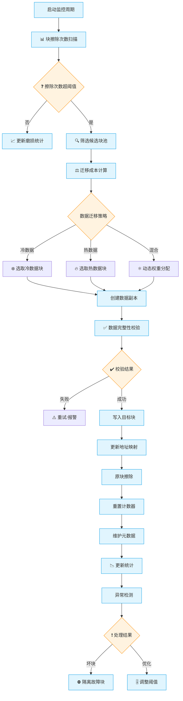

```mermaid
%%{init: {'themeVariables': { 'fontFamily': 'verdana'}}}%%
flowchart TD
    A["🔄 启动监控周期"] --> B["📊 块擦除次数扫描"]
    B --> C{"❓ 擦除次数超阈值"}
    
    C -->|否| D["📈 更新磨损统计"]
    C -->|是| E["🔍 筛选候选块池"]
    
    E --> F["⚖️ 迁移成本计算"]
    F --> G{"📌 数据迁移策略"}
    
    G -->|冷数据| H["❄️ 选取冷数据块"]
    G -->|热数据| I["🔥 选取热数据块"]
    G -->|混合| J["⚛️ 动态权重分配"]
    
    H --> K["📑 创建数据副本"]
    I --> K
    J --> K
    
    K --> L["✅ 数据完整性校验"]
    L --> M{"✔️ 校验结果"}
    
    M -->|失败| N["⚠️ 重试/报警"]
    M -->|成功| O["💾 写入目标块"]
    
    O --> P["🔄 更新地址映射"]
    P --> Q["🧹 原块擦除"]
    Q --> R["🔢 重置计数器"]
    R --> S["📝 维护元数据"]
    S --> T["📉 更新统计"]
    T --> U["🔔 异常检测"]
    
    U --> V{"❗ 处理结果"}
    V -->|坏块| W["⛔ 隔离故障块"]
    V -->|优化| X["🎚️ 调整阈值"]

    classDef process fill:#E1F5FE,stroke:#039BE5;
    classDef decision fill:#FFF3E0,stroke:#FB8C00;
    class A,B,D,E,F,K,L,O,P,Q,R,S,T,U,W,X process
    class C,G,M,V decision
```