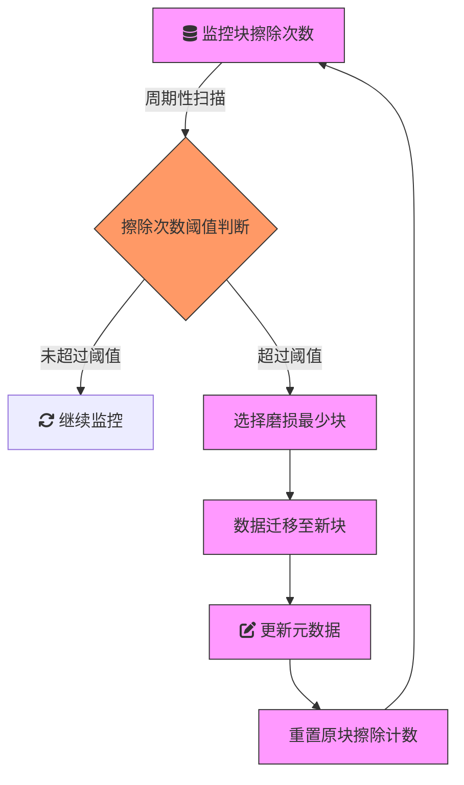

```mermaid
graph TD
    A[fa:fa-database 监控块擦除次数] -->|周期性扫描| B{擦除次数阈值判断}
    B -->|未超过阈值| C[fa:fa-sync 继续监控]
    B -->|超过阈值| D[选择磨损最少块]
    D --> E[数据迁移至新块]
    E --> F[fa:fa-edit 更新元数据]
    F --> G[重置原块擦除计数]
    G --> A

    classDef process fill:#f9f,stroke:#333;
    classDef decision fill:#f96,stroke:#333;
    class A,D,E,F,G process
    class B decision

```